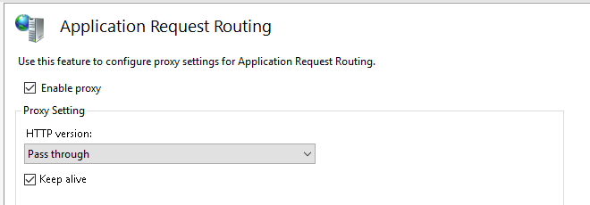

# Deployment of SPA

There are many ways to deploy ASP.NET Core single-page application. The preferred one is to have different domains for backend and frontend.

Read the articles for more information:

- [ASP.NET Core Deployment](AspNetCoreDeployment.md)
- [ASP.NET Core Module](https://docs.microsoft.com/en-us/aspnet/core/host-and-deploy/aspnet-core-module?view=aspnetcore-2.2)

## Separate Domains

🌐 example.com
- index.html
- web.config

🌐 example-backend.com
- Example.Web.dll
- web.config

Frontend and backend are separate web sites. Static files are served by IIS.

### Backend

```powershell
Invoke-WebDeployment -PackagePath 'Example.zip' -ServerHost 'web.example.com' -SiteName 'example-backend.com' -Application ''
```

```powershell
Sync-WebContent -ContentPath 'C:\example-backend\Example.Web\bin\Release\netcoreapp2.1\publish' -ServerHost 'web.example.com' -SiteName 'example-backend.com' -Application ''
```

```bat
msdeploy.exe -source:package='Example.zip' -dest:auto,computerName='https://web.example.com:8172/msdeploy.axd?site=example-backend.com' -verb:sync -setParam:name='IIS Web Application Name',value='example-backend.com/'
```

### Frontend

```powershell
Sync-WebContent -ContentPath 'C:\example-frontend\dist' -ServerHost 'web.example.com' -SiteName 'example.com' -Application ''
```

```bat
msdeploy.exe -source:contentPath='C:\example-frontend\dist' -dest:contentPath='example.com/',computerName='https://web.example.com:8172/msdeploy.axd?site=example.com' -verb:sync
```

### Reverse Proxy

You may configure reverse-proxy to serve API and static files on the same domain. Need to install UrlRewrite and Application Request Routing (ARR).

See Install-Iis, Install-UrlRewrite and Install-Arr cmdlets in [PSGallery](https://github.com/Saritasa/PSGallery/blob/master/docs/Saritasa.RemoteManagement.md) or use `msiexec`:

```powershell
msiexec /i http://download.microsoft.com/download/C/9/E/C9E8180D-4E51-40A6-A9BF-776990D8BCA9/rewrite_amd64.msi
msiexec /i http://download.microsoft.com/download/E/9/8/E9849D6A-020E-47E4-9FD0-A023E99B54EB/requestRouter_amd64.msi
```

Enable proxy mode in ARR.



Change `web.config` for `example-frontend.com` site.

```xml
<?xml version="1.0" encoding="UTF-8"?>
<configuration>
    <system.webServer>
        <rewrite>
            <rules>
                <rule name="API rewrite" stopProcessing="true">
                    <match url="^api/.*" />
                    <action type="Rewrite" url="https://example-backend.com/{R:0}" />
                </rule>
            </rules>
        </rewrite>
    </system.webServer>
</configuration>
```

✔ Static files are served by IIS.

✔ Easy to deploy.

✔ Easy to debug frontend.

💡 Prefer to use different domains. Reverse proxy adds unwanted latency.

💡 Need to configure correct CORS settings for API.

## AspNetCoreModule with Prefix

🌐 example.com
- 📁 api
  - Example.Web.dll
- index.html
- web.config

ASP.NET Core app is located in **/api** directory. Web.config contains a prefix for it. Static files are served by IIS.

### web.config (backend)

```xml
<?xml version="1.0" encoding="utf-8"?>
<configuration>
  <system.webServer>
    <handlers>
      <remove name="aspNetCore" />
      <add name="aspNetCore" path="api/*" verb="*" modules="AspNetCoreModule" resourceType="Unspecified" />
    </handlers>
    <aspNetCore processPath="dotnet" arguments=".\api\Example.Web.dll" stdoutLogEnabled="false" stdoutLogFile=".\logs\stdout" />
  </system.webServer>
</configuration>
```

### Backend

```powershell
Sync-WebContent -ContentPath 'C:\example-backend\Example.Web\bin\Release\netcoreapp2.1\publish' -ServerHost 'web.example.com' -SiteName 'example.com' -Application 'api'
```

```bat
msdeploy.exe -source:contentPath='C:\example-backend\Example.Web\bin\Release\netcoreapp2.1\publish' -dest:contentPath='example.com/api',computerName='https://web.example.com:8172/msdeploy.axd?site=example.com' -verb:sync
```

### Frontend

```powershell
Sync-WebContent -ContentPath 'C:\example-frontend\dist' -ServerHost 'web.example.com' -SiteName 'example.com' -Application ''
```

```bat
msdeploy.exe -source:contentPath='C:\example-frontend\dist' -dest:contentPath='example.com/',computerName='https://web.example.com:8172/msdeploy.axd?site=example.com' -verb:sync
```

✔ Static files are hosted by IIS.

✔ API routes are not changed.

❌ **/api** must be a virtual directory. It can't be an application.

❌ web.config for ASP.NET Core must be deployed with the frontend.

❌ appsettings.json must be placed to site root or application must be modified to find it.

## Separate Applications

🌐 example.com
- ⚙ api
    - Example.Web.dll
    - web.config
- index.html
- web.config

ASP.NET Core is served as **/api** application and may be located in a different directory. Routes should not include /api/ prefix. Static files are served by IIS.

### Backend

```powershell
Invoke-WebDeployment -PackagePath 'Example.zip' -ServerHost 'web.example.com' -SiteName 'example.com' -Application 'api'
```

```powershell
Sync-WebContent -ContentPath 'C:\example-backend\Example.Web\bin\Release\netcoreapp2.1\publish' -ServerHost 'web.example.com' -SiteName 'example.com' -Application 'api'
```

```bat
msdeploy.exe -source:package='Example.zip' -dest:auto,computerName='https://web.example.com:8172/msdeploy.axd?site=example.com' -verb:sync -setParam:name='IIS Web Application Name',value='example.com/api'
```

### Frontend

```powershell
Sync-WebContent -ContentPath 'C:\example-frontend\dist' -ServerHost 'web.example.com' -SiteName 'example.com' -Application '' -MSDeployParams @('-skip:Directory=api')
```

```bat
msdeploy.exe -source:contentPath='C:\example-frontend\dist' -dest:contentPath='example.com/',computerName='https://web.example.com:8172/msdeploy.axd?site=example.com' -verb:sync -skip:Directory=api
```

✔ Static files are served by IIS.

❌ API routes should not start with **api/** prefix.

## Kestrel for Static Files

🌐 example.com
- 📁 wwwroot
  - index.html
- Example.Web.dll
- web.config

ASP.NET Core files are located in web site root directory. Static files are served by Kestrel.

### web.config

```xml
<?xml version="1.0" encoding="utf-8"?>
<configuration>
  <system.webServer>
    <handlers>
      <remove name="aspNetCore" />
      <add name="aspNetCore" path="*" verb="*" modules="AspNetCoreModule" resourceType="Unspecified" />
    </handlers>
    <aspNetCore processPath="dotnet" arguments=".\Example.Web.dll" stdoutLogEnabled="false" stdoutLogFile=".\logs\stdout" />
  </system.webServer>
</configuration>
```

### Backend

```powershell
Invoke-WebDeployment -PackagePath 'Example.zip' -ServerHost 'web.example.com' -SiteName 'example.com' -Application '' -MSDeployParams @('-skip:Directory=wwwroot')
```

```powershell
Sync-WebContent -ContentPath 'C:\example-backend\Example.Web\bin\Release\netcoreapp2.1\publish' -ServerHost 'web.example.com' -SiteName 'example.com' -Application '' -MSDeployParams @('-skip:Directory=wwwroot')
```

### Frontend

```powershell
Sync-WebContent -ContentPath 'C:\example-frontend\dist' -ServerHost 'web.example.com' -SiteName 'example.com' -Application 'wwwroot'
```

```bat
msdeploy.exe -source:contentPath='C:\example-frontend\dist' -dest:contentPath='example.com/wwwroot',computerName='https://web.example.com:8172/msdeploy.axd?site=example.com' -verb:sync
```

✔ Easy to deploy.

❌ Static files are served by Kestrel.
