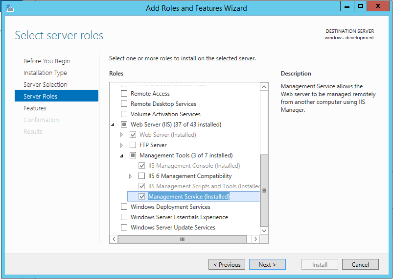
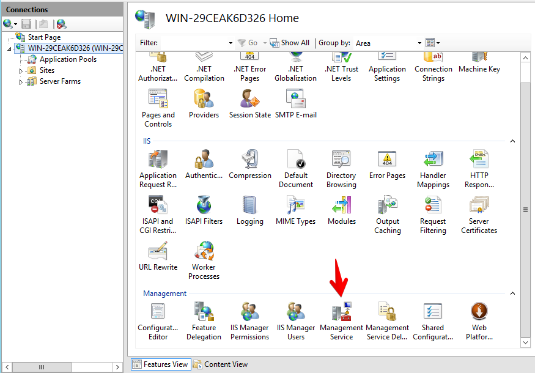
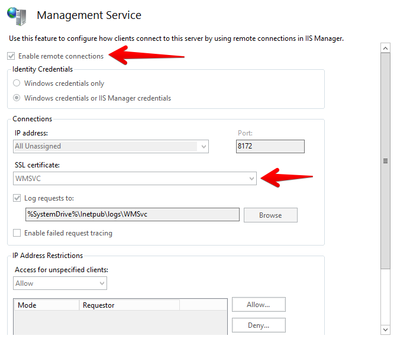
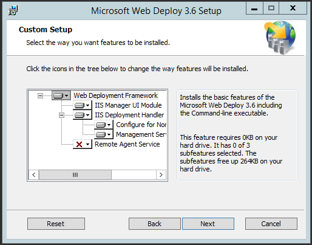
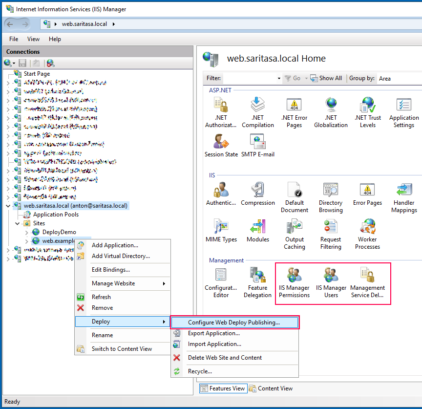
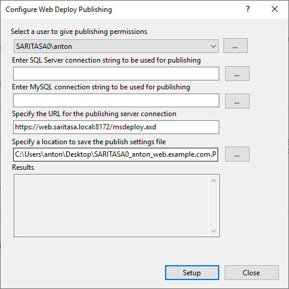

# Web Deploy Configuration

Web Deploy (msdeploy) is used to publish ASP.NET web projects and synchronize directories over the network.

There are 2 different configurations of Web Deploy:
- Web Deploy Remote Agent Service
- Web Deploy Handler

We use Web Deploy Handler, because it allows non-administrator users to create IIS applications and copy files.

Read the article for more details:
- [Configuring a Web Server for Web Deploy Publishing (Web Deploy Handler)](https://docs.microsoft.com/en-us/aspnet/web-forms/overview/deployment/configuring-server-environments-for-web-deployment/configuring-a-web-server-for-web-deploy-publishing-web-deploy-handler)

## Ansible

Ansible playbook is the best way to configure web server. See examples in the repository:

<https://github.com/Saritasa/dotnet-deploy>

It installs necessary software, creates web site, deploy user and grants permissions.

## PowerShell

See Install-Iis, Install-WebManagementService, Install-WebDeploy cmdlets in [Saritasa.RemoteManagement](https://github.com/Saritasa/PSGallery/blob/master/docs/Saritasa.RemoteManagement.md) module. Patched [AddDelegationRules.ps1](https://github.com/Saritasa/PSGallery/blob/master/scripts/WebDeploy/AddDelegationRules.ps1) and [SetupSiteForPublish.ps1](https://github.com/Saritasa/PSGallery/blob/master/scripts/WebDeploy/SetupSiteForPublish.ps1) scripts are used for automation.

See the [instruction](../WindowsRemoteAdministration/WinRMConfiguration.md#generate-new-certificate) how to change generate and change WMSvc certificate.

## Manual Install

Install Web Management service.

Enable remote connections, select SSL certificate. Unfortunately, the snap-in does not work remotely.

Install Web Deploy. Do it *after* management service installation. Select `IIS Deployment Handler` and `IIS Manager UI Module` components.

Disable password expiration for `WDeployAdmin` and `WDeployConfigWriter` users.

## Configure Web Site

Open `Configure Web Deploy Publishing` dialog in IIS Manager. Use Windows or IIS user.

