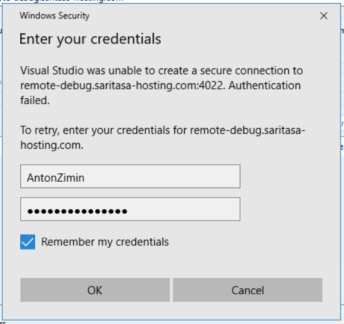
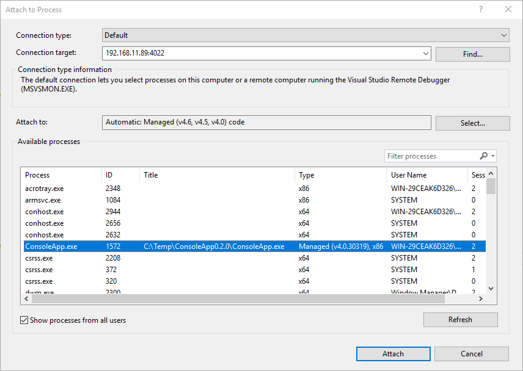
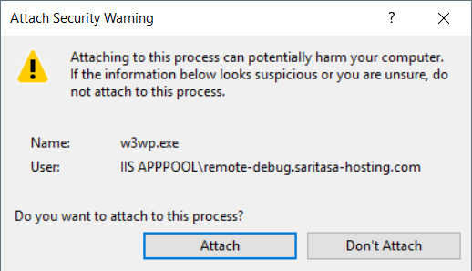
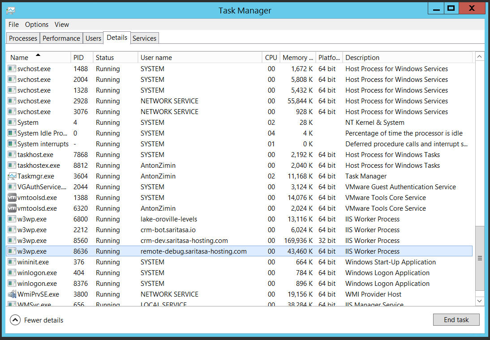
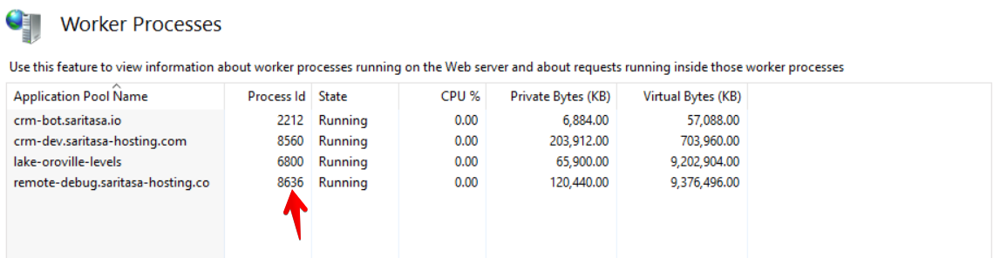
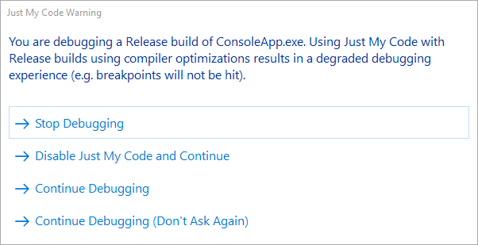
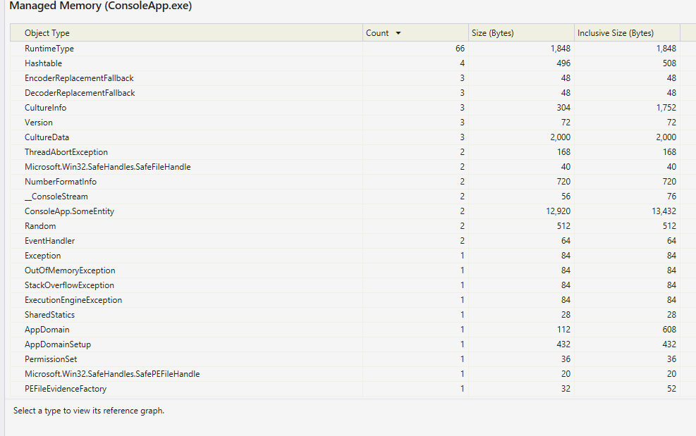
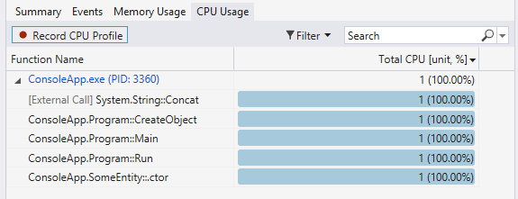

# Connect to Remote Debugger

## Attach to Process

Click `Debug` -> `Attach to Process...` to open a dialog.

Enter host name in `Connection target` field. Press `Enter`. Enter credentials.

## Attach to IIS

If you want to debug ASP.NET application, attach to w3wp.exe process.

## Compiler Optimizations

You may need to disable `Just My Code` option when debug optimized applications (release mode).

## Diagnostic Tools

You can see memory and CPU usage in Diagnostic Tools panel.

