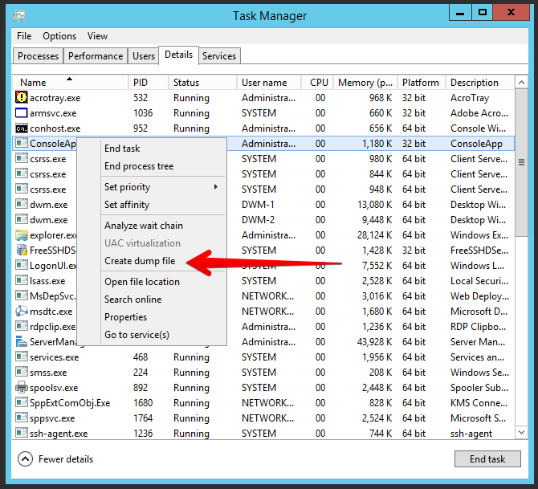
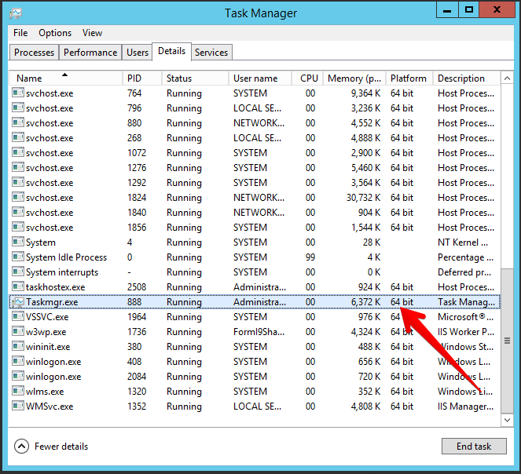
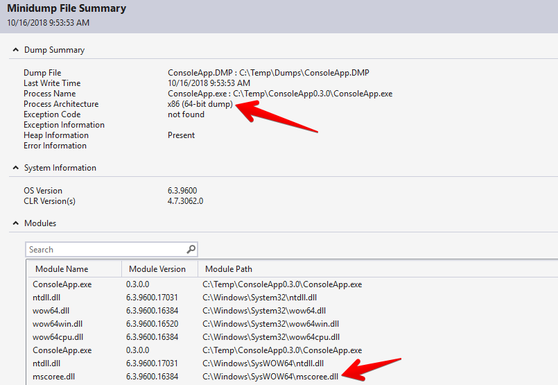
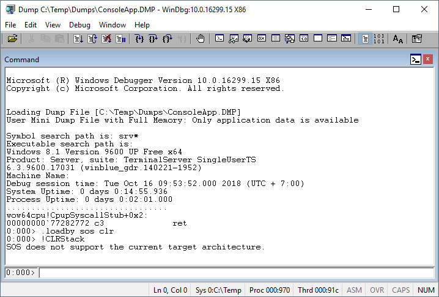
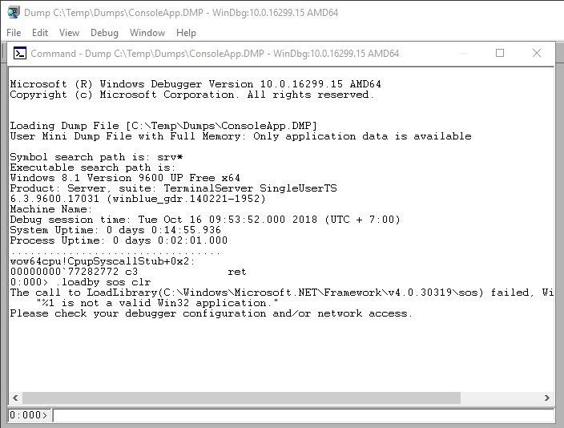
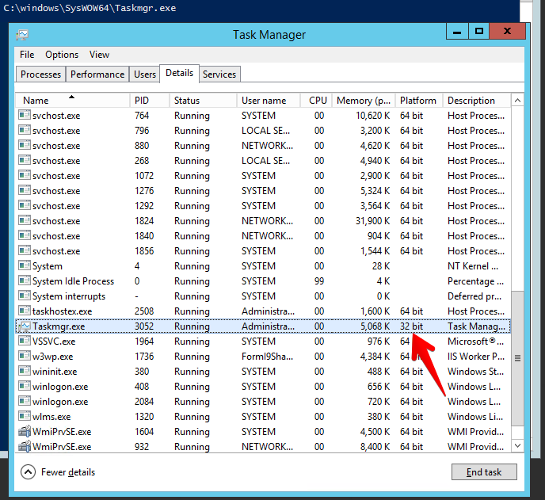
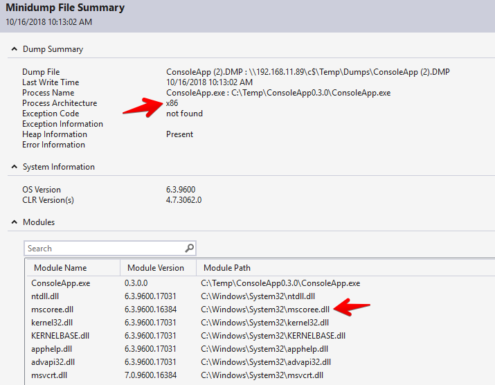
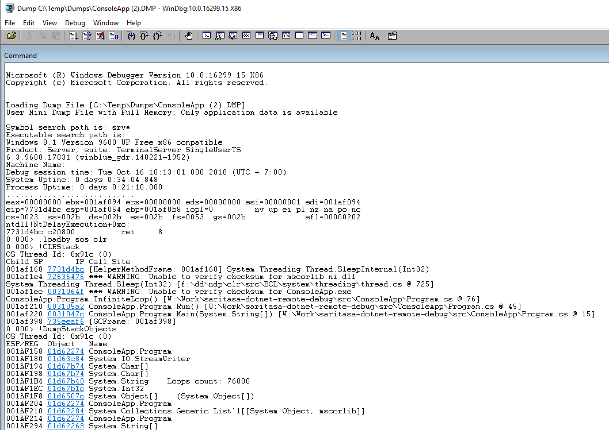

# Create Process Dump

Dump file may contain information about process memory, open handles, system environment.

Read articles:
- [User-Mode Dump Files](https://docs.microsoft.com/en-us/windows-hardware/drivers/debugger/user-mode-dump-files)
- [Effective Minidumps](http://www.debuginfo.com/articles/effminidumps.html)

Many tools can create dump files: [ADPlus](https://docs.microsoft.com/en-us/windows-hardware/drivers/debugger/adplus), [WER](https://docs.microsoft.com/en-us/windows/desktop/wer/collecting-user-mode-dumps), [DebugDiag](DebugDiagnosticTool.md), Task Manager.

## Create a Dump using Task Manager

Task Manager has a simple feature to create dump files, there are no any settings.

Important rule - use a correct version of Task Manager (x86 or x64). It should match the target application platform.

[Do not collect 32bit process’ dumps with 64bit task manager](https://blogs.msdn.microsoft.com/amb/2011/05/12/do-not-collect-32bit-process-dumps-with-64bit-task-manager/)

64-bit version: `C:\Windows\System32\Taskmgr.exe`

32-bit version: `C:\Windows\SysWOW64\Taskmgr.exe`

### Wrong Example

I created a dump file of 32-bit application using 64-bit Task Manager.

It has `x86 (64-bit dump)` process architecture and can't be loaded by both WinDbg x86 and x64.

### Correct Example

Started 32-bit Task Manager to create a dump of 32-bit application.

It has `x86` process architecture and can be loaded by WinDbg.

