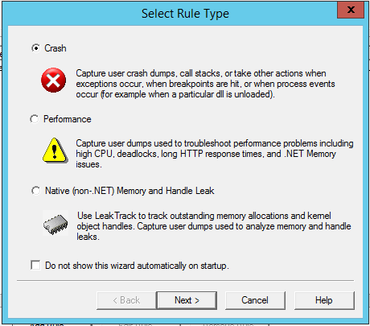
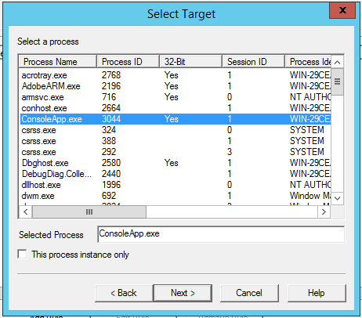
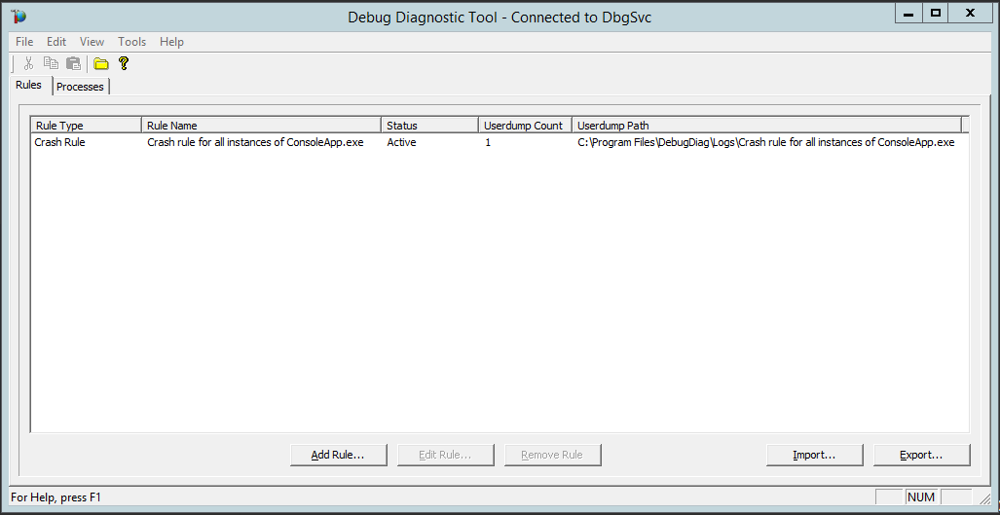
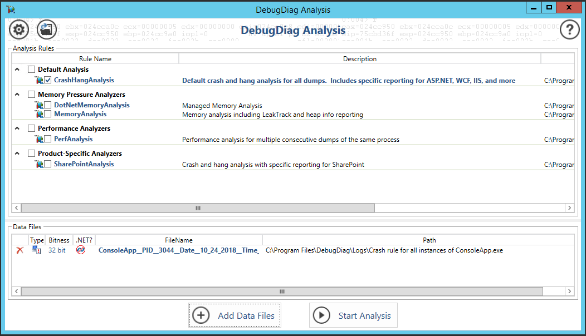
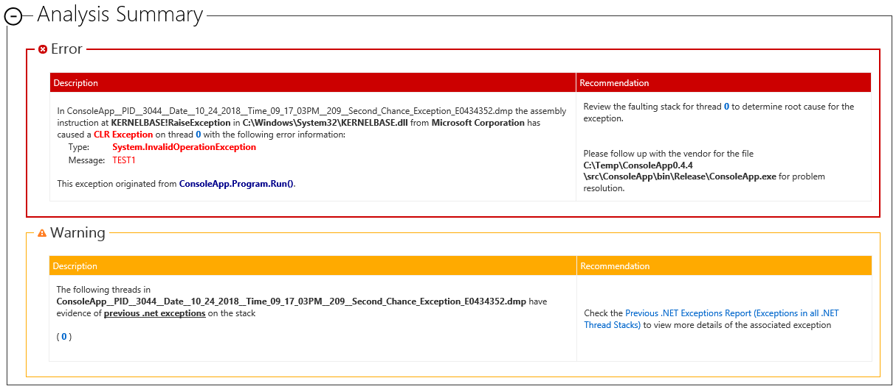
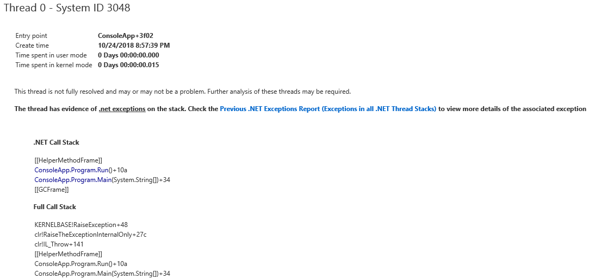
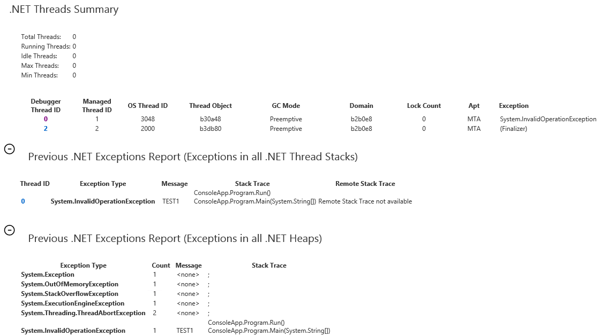

# Debug Diagnostic Tool

DebugDiag is a tool to collect crash dumps, analyze them and generate reports.

[Debug Diagnostic Tool v2 Update 2](https://www.microsoft.com/en-us/download/details.aspx?id=49924)

## Collect Crash and Hang Dumps

You can create dump files after crash, by process memory limit or with other rules.

Run `DebugDiag 2 Collection`. Create a rule.

## Analyze Dumps

Run `DebugDiag 2 Analysis`. Add one or several dumps. Enable necessary analysis rules and click `Start Analysis`.

