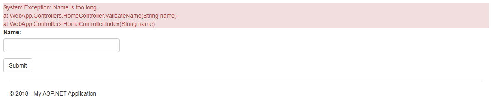
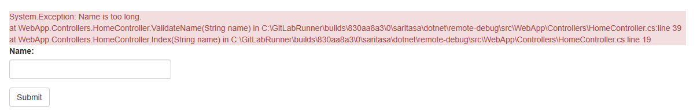
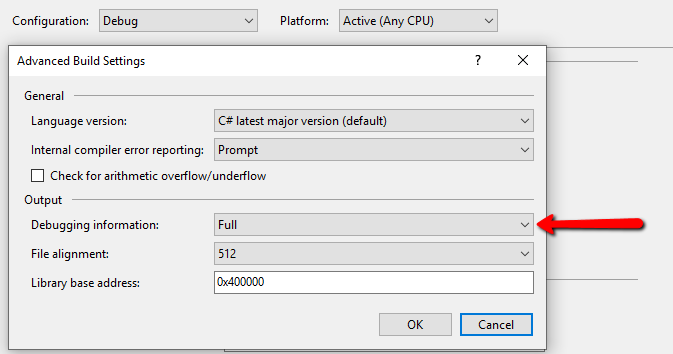
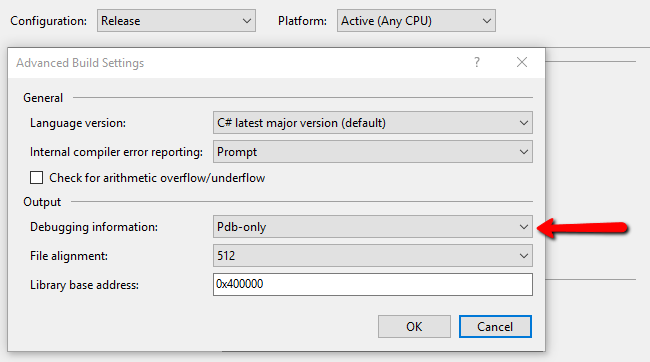
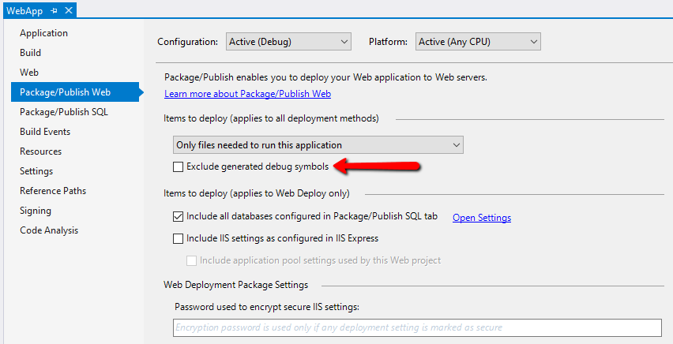

# Debug Symbols Configuration

PDB files contain information required to debug apps and analyze dump files.

Read articles about PDB files:
- [Introduction to Symbols](https://docs.microsoft.com/en-us/windows-hardware/drivers/debugger/introduction-to-symbols)
- [PDB Files: What Every Developer Must Know](https://www.wintellect.com/pdb-files-what-every-developer-must-know/)

.NET Core introduces a new format - [Portable PDB](https://github.com/dotnet/core/blob/master/Documentation/diagnostics/portable_pdb.md).

## Stack Trace Information

PDB files allow to get information about line numbers in stack traces.

No PDB file:



```
System.Exception: Name is too long.
at WebApp.Controllers.HomeController.ValidateName(String name)
at WebApp.Controllers.HomeController.Index(String name)
```

PDB file presents:



```
System.Exception: Name is too long.
at WebApp.Controllers.HomeController.ValidateName(String name) in C:\GitLabRunner\builds\830aa8a3\0\saritasa\dotnet\remote-debug\src\WebApp\Controllers\HomeController.cs:line 39
at WebApp.Controllers.HomeController.Index(String name) in C:\GitLabRunner\builds\830aa8a3\0\saritasa\dotnet\remote-debug\src\WebApp\Controllers\HomeController.cs:line 19
```

## Debugging Information Setting

By default, Debug configuration has `Full` debugging information, Release - `Pdb-only`.





Actually, there is no difference between them starting .NET 2.0: [Visual C# Compiler Options](https://github.com/dotnet/roslyn/blob/master/docs/compilers/CSharp/CommandLine.md)

## Web Package Settings

If you want to deploy PDB files to web server, make sure the `Exclude generated debug symbols` check-box is unset.


