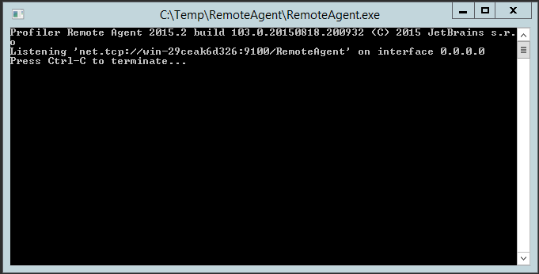
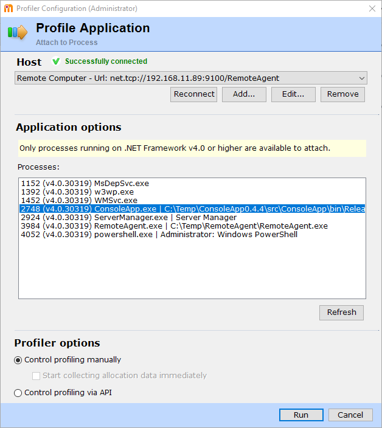
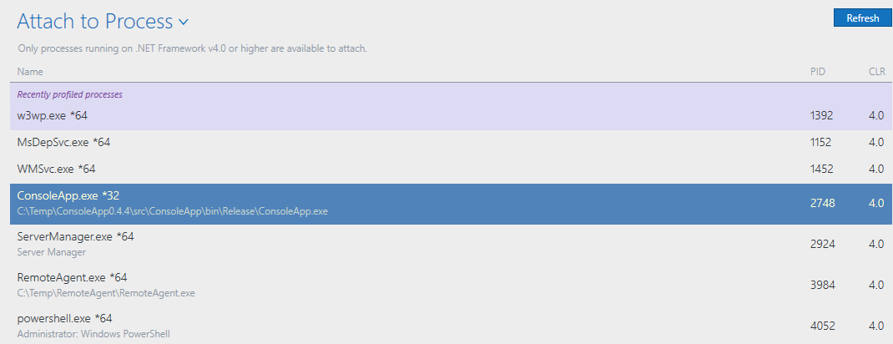
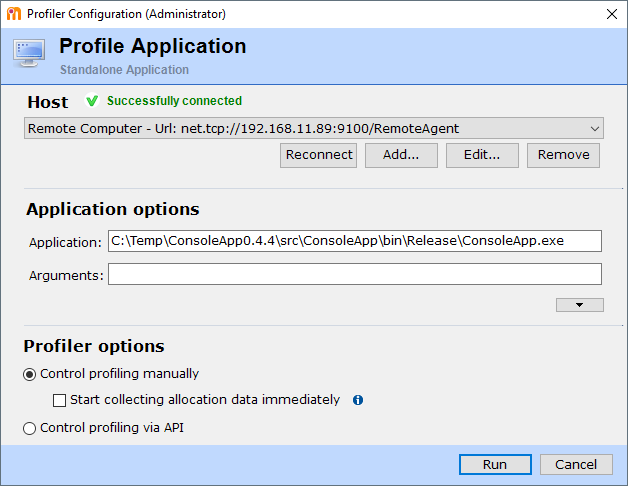
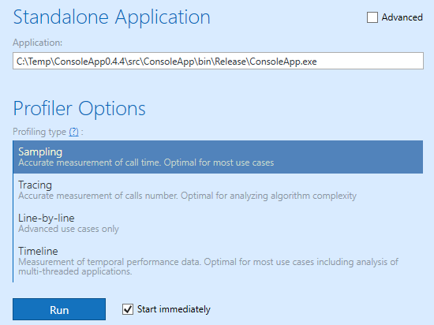

# JetBrains Remote Profiling

[Starting Remote Profiling Session](https://www.jetbrains.com/help/profiler/Starting_Remote_Profiling_Session.html)

## Install

Copy `RemoteAgent.zip` from `dotMemory[N]` or `dotTrace[N]` directory located in `%localappdata%\JetBrains\Installations` to target server.

Run the agent.



Add firewall rule.

```powershell
New-NetFirewallRule -DisplayName 'JetBrains Remote Agent' -Direction Inbound -LocalPort 9100 -Protocol TCP -Action Allow
```

## Connect

Open dotMemory or dotTrace. Click `Attach to Process`. Enter address of remote agent:

```
net.tcp://hostname:9100/RemoteAgent
```





You can also start a new application instance.




