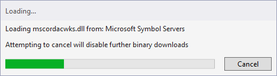
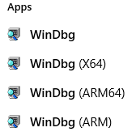

# Open Dump File

## Open in Visual Studio

Click `Open File`. Choose the dump. Configure symbol paths, click `Debug with Managed Only`.

Visual Studio will download the necessary version of .NET runtime from Microsoft servers.



## Open in WinDbg

Run correct version of WinDbg.



Click `File` -> `Open Crash Dump...`. Configure symbol paths.


[Symbol path for Windows debuggers](https://docs.microsoft.com/en-us/windows-hardware/drivers/debugger/symbol-path)

## Load SOS

SOS is a debugging extension for managed code.

[SOS.dll (SOS debugging extension)](https://docs.microsoft.com/en-us/dotnet/framework/tools/sos-dll-sos-debugging-extension)

Use following command to load SOS in WinDbg:

```
.loadby sos clr
```

It will load required `mscorwks.dll` or `mscordacwks.dll` from Microsoft servers. The modules are .NET runtime and data-access object for it.

If your runtime version is old and specific, it may be unavailable on Microsoft site. Read following articles for information about obtaining the correct libraries.

- [Obtaining Correct Mscordacwks.dll for .NET WinDbg’ing](https://chentiangemalc.wordpress.com/2014/04/16/obtaining-correct-mscordacwks-dll-for-net-windbging/)
- [Obtaining mscordacwks.dll for CLR Versions You Don’t Have](https://dzone.com/articles/obtaining-mscordacwksdll-clr)
