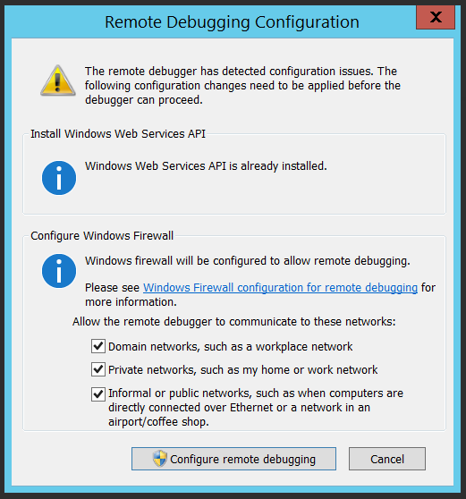
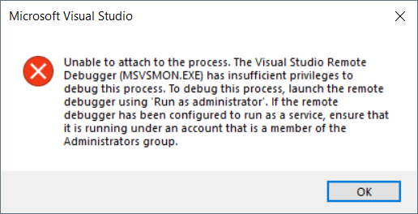
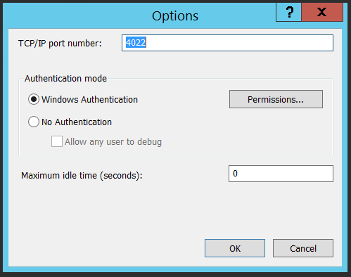
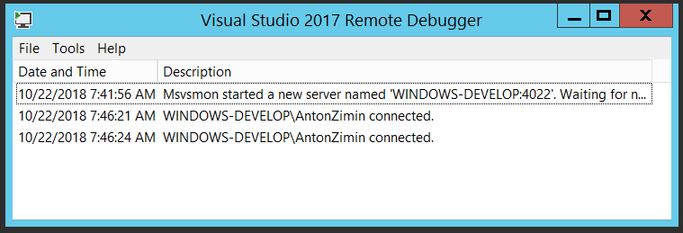
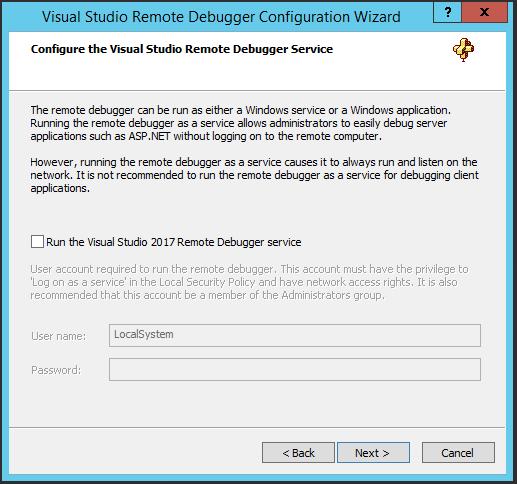

# Run Remote Tools for Visual Studio

## Install

Read documentation about [Remote Debugging](https://docs.microsoft.com/en-us/visualstudio/debugger/remote-debugging?view=vs-2017).

Download [Remote Tools for Visual Studio 2017](https://visualstudio.microsoft.com/downloads/?q=remote+tools#remote-tools-for-visual-studio-2017). Select x64 platform. Run the installer.

## Run

Run Remote Debugger. Configure firewall rules.

If you need to debug ASP.NET applications or services, run the debugger as administrator.

It listens on port 4022 and uses Windows authentication by default.

Connection events are displayed in the window.

## Run as a Service

Use Remote Debugger Configuration Wizard to run the debugger as Windows service. Configure firewall rules.

