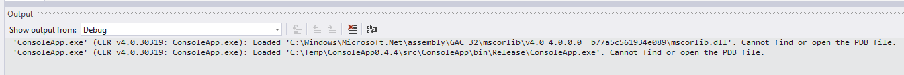
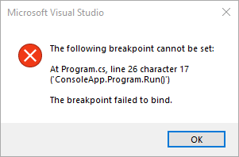
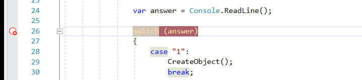
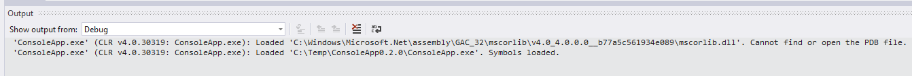
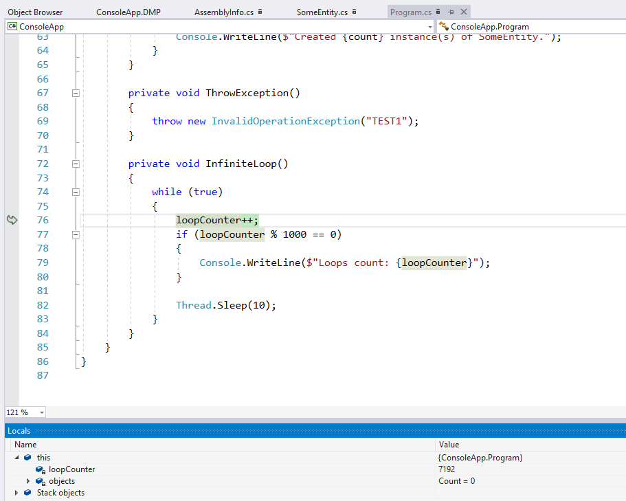
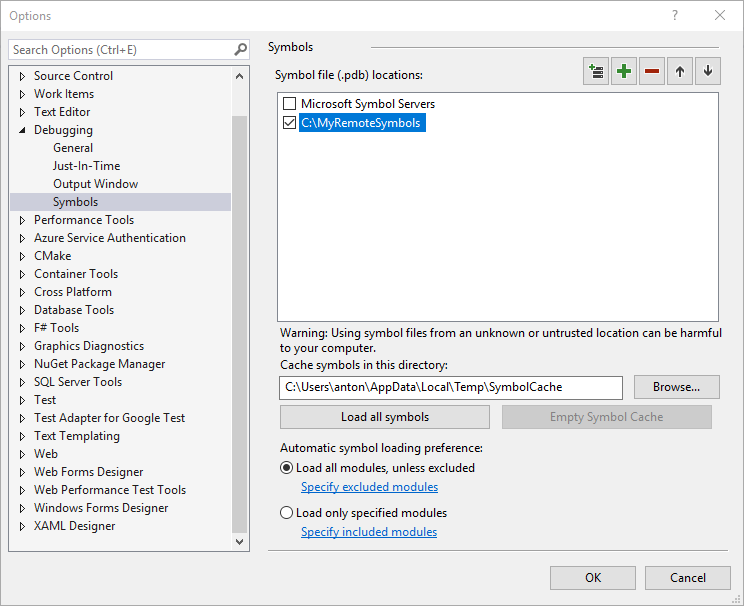
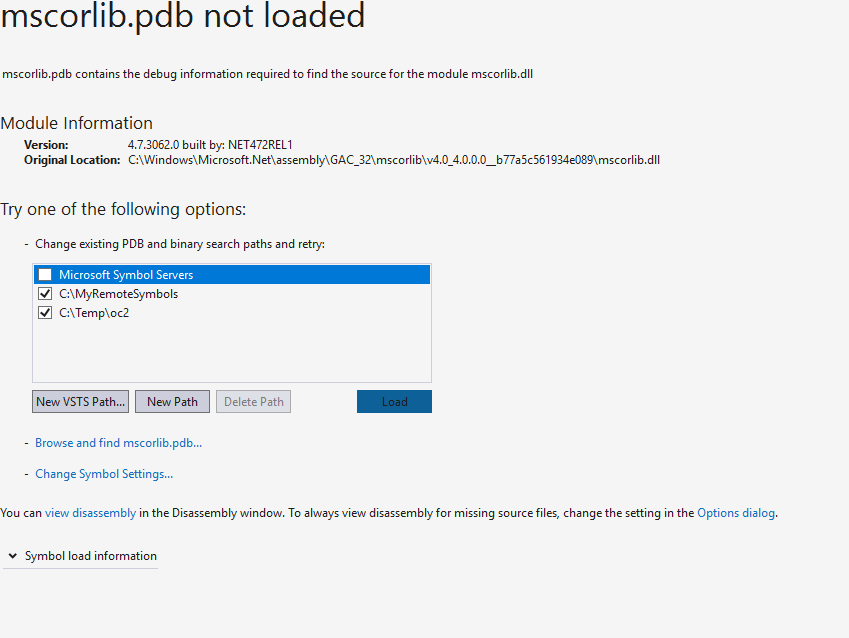
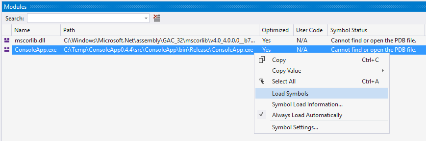
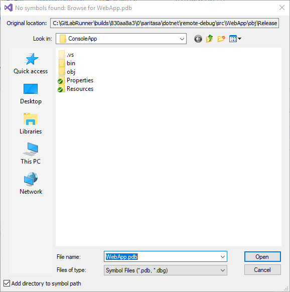
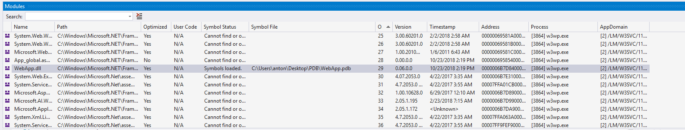

# Set Symbols Path

There are many ways to set path to symbols in Visual Studio.

- Set up symbols server.
- Set up network share or local directory using SymStore.
- Copy necessary PDB files to local directory (flat structure).
- Set path to PDB file manually from Modules window.
- Use remote symbols (`/FallbackLoadRemoteManagedPdbs` option).

[Understanding symbol files and Visual Studio’s symbol settings](https://blogs.msdn.microsoft.com/devops/2015/01/05/understanding-symbol-files-and-visual-studios-symbol-settings/)

## Symbols Not Loaded

If symbols are not loaded, you will see messages in output window:



It's not possible to set breakpoints:



Existing breakpoints are inactive:



## Symbols Loaded




You can set breakpoints, see variable values and call stack.



## Specify Symbols Path

Read an article: [Specify symbol (.pdb) and source files in the Visual Studio debugger](https://docs.microsoft.com/en-us/visualstudio/debugger/specify-symbol-dot-pdb-and-source-files-in-the-visual-studio-debugger?view=vs-2017)



## Specify PDB File Location

If program hits a breakpoint but symbol loading failed, Visual Studio shows a dialog. You may change symbols paths or locate the PDB file manually.



You also can click `Load Symbols` in Modules panel.







## Download PDB Files

Use PowerShell to download PDB files from server.

```powershell
$s = New-PSSession crm-dev.saritasa-hosting.com -UseSSL -Credential AntonZimin -Authentication Basic
Copy-Item C:\inetpub\wwwroot\remote-debug.saritasa-hosting.com\bin\*.pdb -FromSession $s .
Remove-PSSession $s
```

## Source Files Location

You can use the [DBH](https://docs.microsoft.com/en-us/windows-hardware/drivers/debugger/dbh) tool to get information about source file paths in PDF file.

```
"C:\Program Files\Debugging Tools for Windows (x64)\dbh.exe" -v "C:\Temp\oc2\ConsoleApp.pdb\518FB3130F9C49DFA0DC8D61F27771F31\ConsoleApp.pdb" dump
verbose mode on.
DBGHELP: ConsoleApp - private symbols & lines
         C:\Temp\oc2\ConsoleApp.pdb\518FB3130F9C49DFA0DC8D61F27771F31\ConsoleApp.pdb - unmatched

ConsoleApp      Run     b       C:\GitLabRunner\builds\830aa8a3\0\saritasa\dotnet\remote-debug\src\ConsoleApp\Program.cs        21      ConsoleApp.Program
ConsoleApp      Main    0       C:\GitLabRunner\builds\830aa8a3\0\saritasa\dotnet\remote-debug\src\ConsoleApp\Program.cs        14      ConsoleApp.Program
ConsoleApp      .ctor   14b     C:\GitLabRunner\builds\830aa8a3\0\saritasa\dotnet\remote-debug\src\ConsoleApp\Program.cs        9       ConsoleApp.Program
ConsoleApp      .ctor   18f     C:\GitLabRunner\builds\830aa8a3\0\saritasa\dotnet\remote-debug\src\ConsoleApp\Properties\Resources.Designer.cs  32      ConsoleApp.Properties.Resources
ConsoleApp      .ctor   15d     C:\GitLabRunner\builds\830aa8a3\0\saritasa\dotnet\remote-debug\src\ConsoleApp\SomeEntity.cs     7       ConsoleApp.SomeEntity
ConsoleApp      get_TestText    1e3     C:\GitLabRunner\builds\830aa8a3\0\saritasa\dotnet\remote-debug\src\ConsoleApp\Properties\Resources.Designer.cs  77      ConsoleApp.Properties.Resources
ConsoleApp      get_ResourceManager     196     C:\GitLabRunner\builds\830aa8a3\0\saritasa\dotnet\remote-debug\src\ConsoleApp\Properties\Resources.Designer.cs  41      ConsoleApp.Properties.Resources
ConsoleApp      CreateObjects   cf      C:\GitLabRunner\builds\830aa8a3\0\saritasa\dotnet\remote-debug\src\ConsoleApp\Program.cs        60      ConsoleApp.Program
ConsoleApp      get_LoremIpsum  1ce     C:\GitLabRunner\builds\830aa8a3\0\saritasa\dotnet\remote-debug\src\ConsoleApp\Properties\Resources.Designer.cs  68      ConsoleApp.Properties.Resources
ConsoleApp      ThrowException  101     C:\GitLabRunner\builds\830aa8a3\0\saritasa\dotnet\remote-debug\src\ConsoleApp\Program.cs        69      ConsoleApp.Program
ConsoleApp      InfiniteLoop    10c     C:\GitLabRunner\builds\830aa8a3\0\saritasa\dotnet\remote-debug\src\ConsoleApp\Program.cs        76      ConsoleApp.Program
ConsoleApp      get_Culture     1c1     C:\GitLabRunner\builds\830aa8a3\0\saritasa\dotnet\remote-debug\src\ConsoleApp\Properties\Resources.Designer.cs  56      ConsoleApp.Properties.Resources
ConsoleApp      set_Culture     1c7     C:\GitLabRunner\builds\830aa8a3\0\saritasa\dotnet\remote-debug\src\ConsoleApp\Properties\Resources.Designer.cs  59      ConsoleApp.Properties.Resources
```

Alternative tool - [cvdump.exe](https://github.com/Microsoft/microsoft-pdb/blob/master/cvdump/cvdump.exe).

```
cvdump.exe -stringtable C:\Temp\oc2\ConsoleApp.pdb\518FB3130F9C49DFA0DC8D61F27771F31\ConsoleApp.pdb
Microsoft (R) Debugging Information Dumper  Version 14.00.23611
Copyright (C) Microsoft Corporation.  All rights reserved.


*** STRINGTABLE

00000001 C:\GitLabRunner\builds\830aa8a3\0\saritasa\dotnet\remote-debug\src\ConsoleApp\Program.cs
0000005a
0000005b c:\gitlabrunner\builds\830aa8a3\0\saritasa\dotnet\remote-debug\src\consoleapp\program.cs
000000b4 C:\GitLabRunner\builds\830aa8a3\0\saritasa\dotnet\remote-debug\src\ConsoleApp\SomeEntity.cs
00000110 c:\gitlabrunner\builds\830aa8a3\0\saritasa\dotnet\remote-debug\src\consoleapp\someentity.cs
0000016c C:\GitLabRunner\builds\830aa8a3\0\saritasa\dotnet\remote-debug\src\ConsoleApp\Properties\Resources.Designer.cs
000001db c:\gitlabrunner\builds\830aa8a3\0\saritasa\dotnet\remote-debug\src\consoleapp\properties\resources.designer.cs
```
