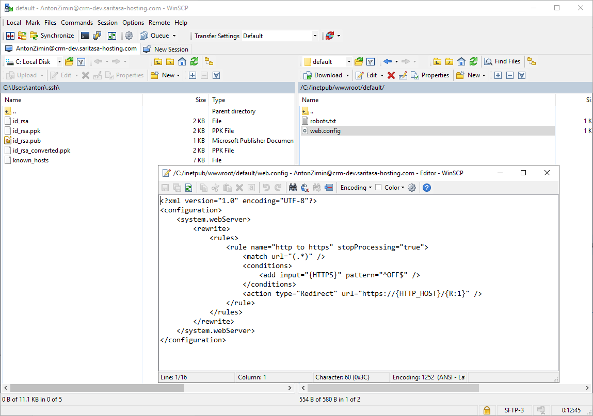
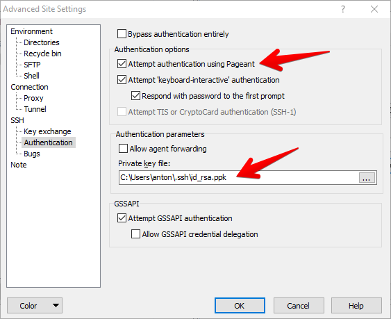
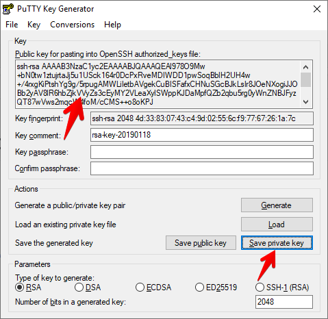
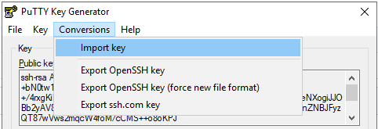
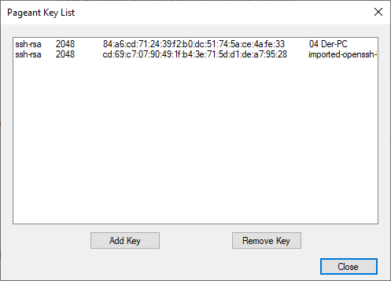
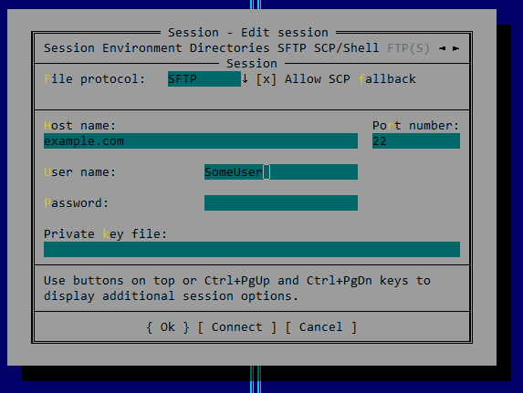
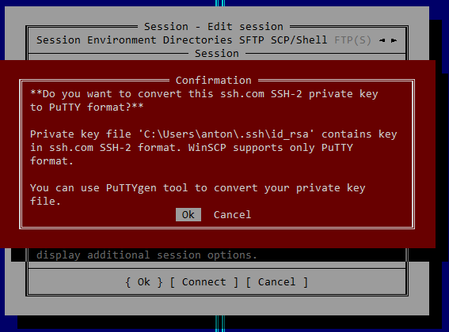
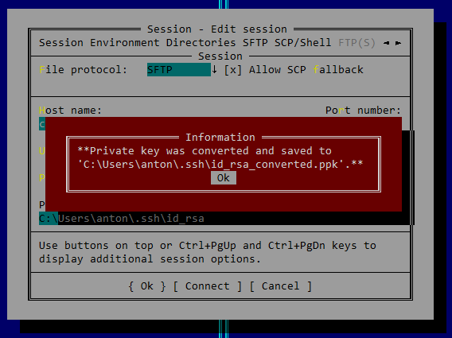
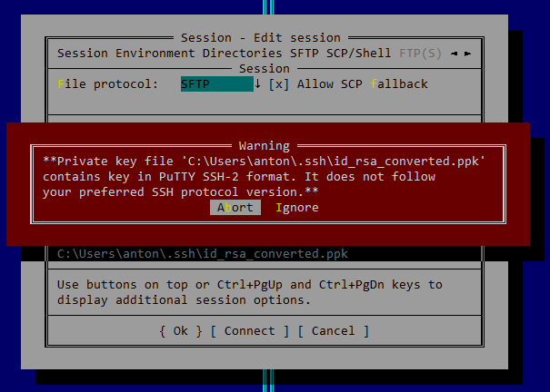

# SFTP

Read [the article](Ssh.md) about SSH configuration on Windows Server. SFTP subsystem is enabled by default with OpenSSH installation.

## WinSCP

WinSCP is an SFTP client. It allows to list directories, transfer and edit files.

WinSCP uses SSH keys in PuTTY format. You can't use OpenSSH keys.

Enable Pageant SSH agent or specify SSH key directly. You have to use Pageant if the key is password protected.

## SSH Key Generation

Use PuTTYgen to generate a new key or convert from OpenSSH format.

## SSH Agent

Pageant (PuTTY authentication agent) is a tool that allows to pass SSH keys to Plink-based SSH clients. Run it and find in a system tray. Click Add Key, select a file and enter a password if needed.

## Far Manager

Far has the NetBox plugin that supports many protocols including SFTP.

Far uses PuTTY key format, but it's able to convert OpenSSH key automatically. Also it supports Pageant and you may use the agent instead of explicit key.

Press `Ignore` if you see following error:

